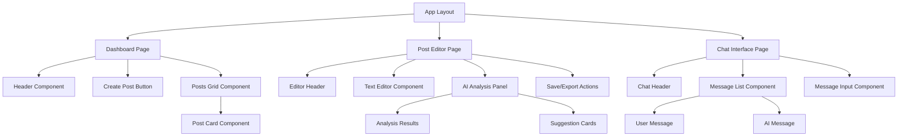
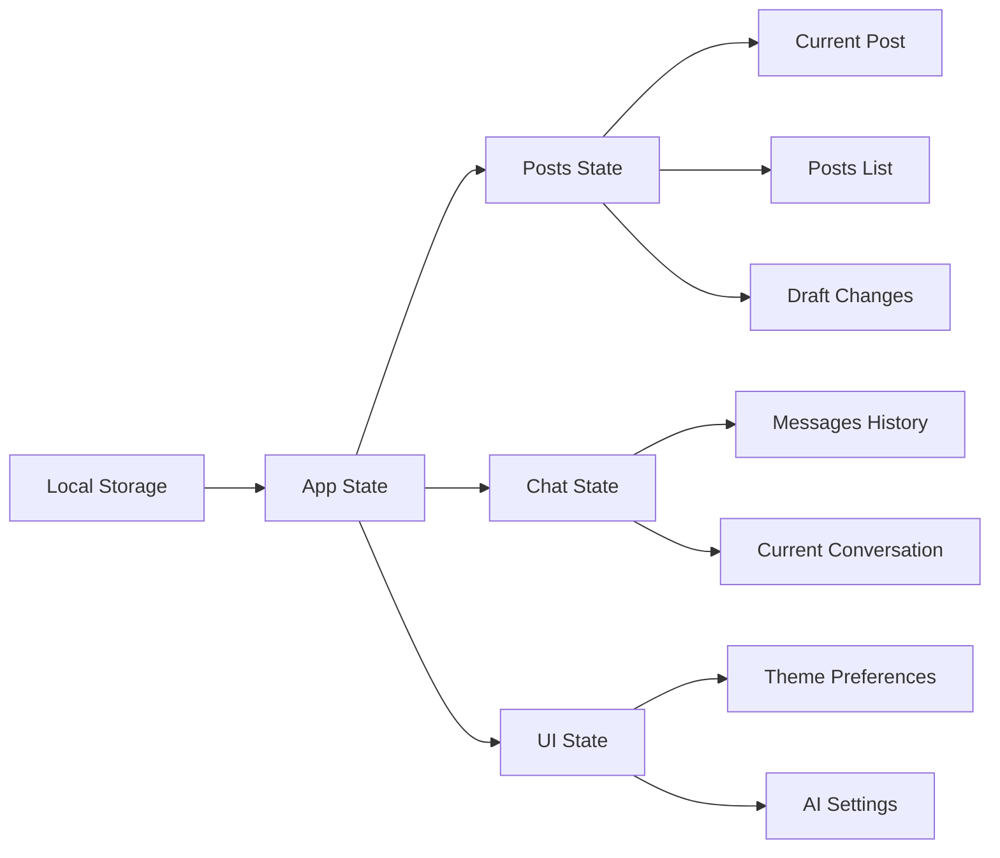
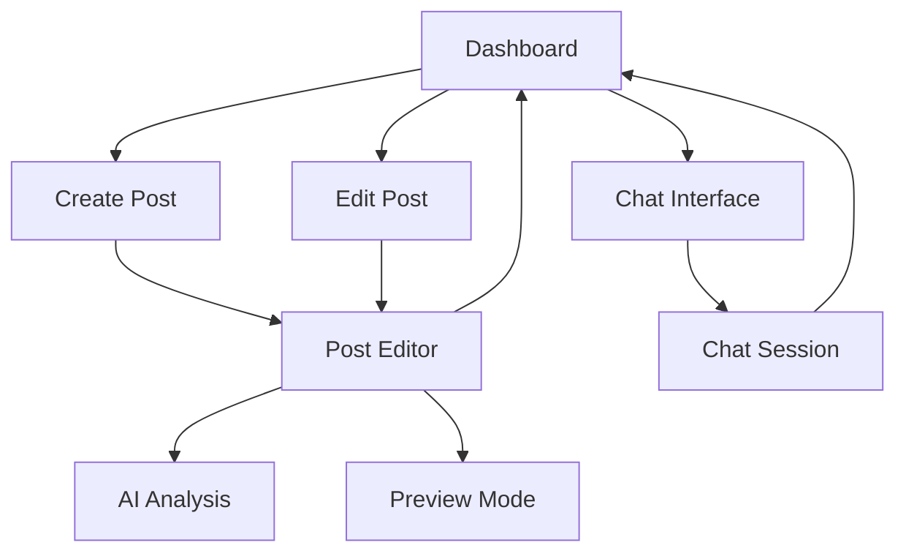
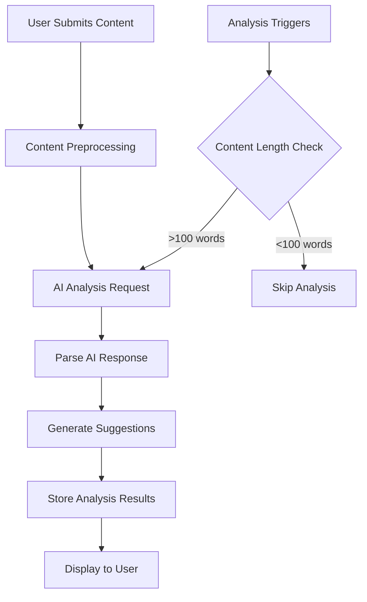
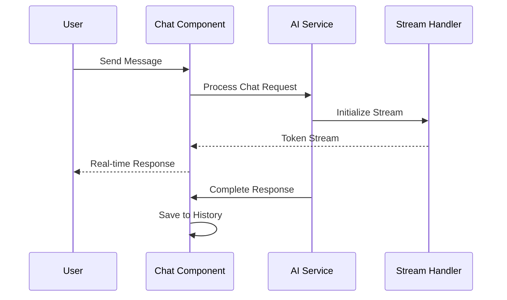
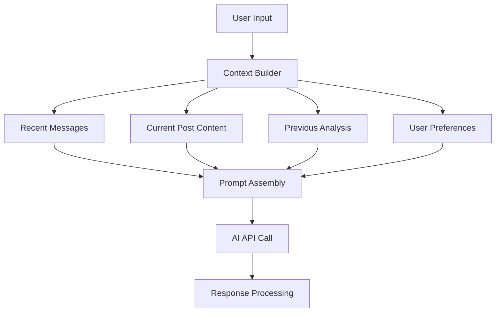
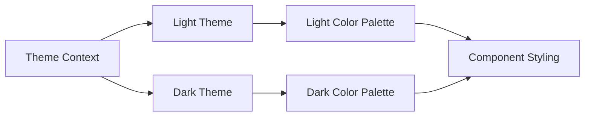
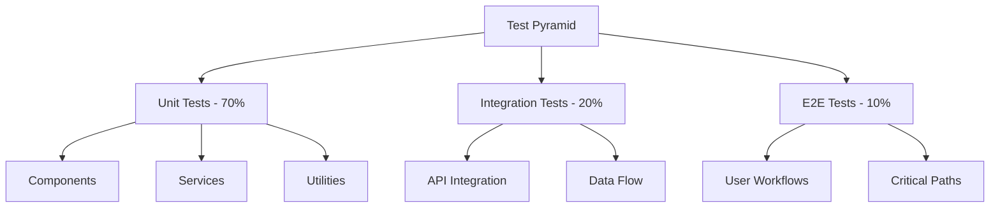
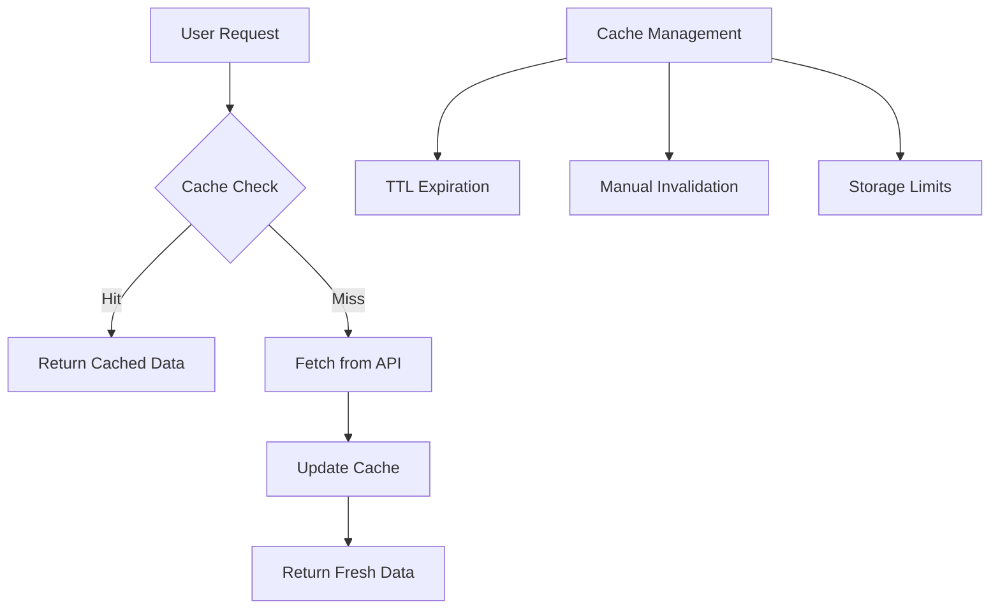

# Writing Assistant Dashboard - Design Document

## Overview

A local web application designed for organizing and analyzing written content, specifically blog posts and ideas. The application features an AI writing assistant that analyzes writing for clarity, audience comprehension, and ambiguity, functioning as an intelligent editor and writing coach.

### Core Objectives
- Provide a centralized dashboard for managing blog posts and writing ideas
- Integrate AI-powered writing analysis for content improvement
- Offer a chat-based interface for natural language interaction with the AI assistant
- Maintain simplicity for single-user, local deployment

## Technology Stack & Dependencies

### Frontend Framework
- **Next.js 14+**: React-based framework for full-stack development
- **React 18+**: Component-based UI library
- **TypeScript**: Type-safe development

### Styling & UI
- **Tailwind CSS**: Utility-first CSS framework
- **Headless UI**: Unstyled, accessible UI components
- **Lucide React**: Icon library for consistent iconography

### AI Integration
- **OpenAI API**: GPT-4 or compatible model for writing analysis
- **Streaming API**: Real-time chat completion responses
- **Custom Prompt Engineering**: Structured prompts for consistent AI behavior

### Data Management
- **Local Storage**: Browser-based persistence for posts and settings
- **IndexedDB**: Structured local database for complex queries
- **JSON Schema**: Data validation and type safety

### Development Tools
- **ESLint**: Code linting and style enforcement
- **Prettier**: Code formatting
- **Husky**: Git hooks for quality control

## Component Architecture

### Component Hierarchy



### Core Components

#### Dashboard Components

**PostCard Component**
- Props: `{ id, title, excerpt, lastModified, wordCount }`
- State: `{ isHovered }`
- Displays post preview with metadata
- Handles click navigation to editor

**PostsGrid Component**
- Props: `{ posts, onPostClick, onDeletePost }`
- State: `{ sortBy, filterBy }`
- Manages post list display and sorting
- Implements search and filter functionality

**CreatePostButton Component**
- Props: `{ onCreatePost }`
- Handles new post creation workflow
- Includes quick templates for different post types

#### Editor Components

**TextEditor Component**
- Props: `{ content, onChange, placeholder }`
- State: `{ currentContent, isDirty, selectionRange }`
- Rich text editing capabilities
- Real-time character/word counting
- Auto-save functionality

**AIAnalysisPanel Component**
- Props: `{ content, isAnalyzing, analysisResults }`
- State: `{ selectedAnalysis, showDetails }`
- Displays writing analysis results
- Provides actionable improvement suggestions

#### Chat Components

**MessageList Component**
- Props: `{ messages, isLoading }`
- State: `{ autoScroll }`
- Displays conversation history
- Handles message streaming and updates

**MessageInput Component**
- Props: `{ onSendMessage, disabled, placeholder }`
- State: `{ inputValue, isComposing }`
- Text input with send functionality
- Supports keyboard shortcuts and commands

### State Management Architecture



## Routing & Navigation

### Route Structure

```
/                    - Dashboard (Posts overview)
/post/new           - Create new post
/post/[id]          - Edit existing post
/post/[id]/preview  - Preview post formatting
/chat               - AI Chat interface
/settings           - Application settings
```

### Navigation Flow



## Data Models & Schema

### Post Data Model

```typescript
interface Post {
  id: string;
  title: string;
  content: string;
  excerpt: string;
  tags: string[];
  createdAt: Date;
  updatedAt: Date;
  wordCount: number;
  status: 'draft' | 'completed' | 'archived';
  analysisHistory: AnalysisResult[];
}
```

### Analysis Result Model

```typescript
interface AnalysisResult {
  id: string;
  postId: string;
  timestamp: Date;
  metrics: {
    readabilityScore: number;
    clarityScore: number;
    toneAnalysis: string;
    targetAudience: string;
  };
  suggestions: Suggestion[];
  ambiguousPhrases: AmbiguousPhrase[];
}

interface Suggestion {
  type: 'clarity' | 'tone' | 'structure' | 'grammar';
  severity: 'low' | 'medium' | 'high';
  description: string;
  originalText: string;
  suggestedText?: string;
  position: { start: number; end: number };
}
```

### Chat Message Model

```typescript
interface ChatMessage {
  id: string;
  role: 'user' | 'assistant';
  content: string;
  timestamp: Date;
  context?: {
    postId?: string;
    analysisId?: string;
  };
  metadata?: {
    wordCount?: number;
    processingTime?: number;
  };
}
```

## Business Logic Layer

### Writing Analysis Engine



#### Analysis Service Architecture

**ContentAnalyzer Class**
- Handles preprocessing of text content
- Manages AI API communication
- Processes and structures analysis results
- Implements caching for repeated analysis

**AnalysisProcessor Class**
- Parses AI responses into structured data
- Generates actionable suggestions
- Calculates readability metrics
- Identifies ambiguous phrases and unclear sections

### Chat Completion System



#### Chat Service Architecture

**ChatService Class**
- Manages conversation context and history
- Implements streaming response handling
- Applies prompt engineering for consistent behavior
- Handles error recovery and retry logic

**PromptManager Class**
- Stores and manages AI system prompts
- Applies context-specific instructions
- Implements verbosity and tone controls
- Ensures consistent AI personality

## AI Integration Layer

### Prompt Engineering Strategy

#### System Prompt Template

```
You are a professional writing editor and coach. Your role is to:

1. ANALYZE writing for clarity, tone, and audience appropriateness
2. IDENTIFY ambiguous phrases and unclear concepts
3. SUGGEST specific improvements without rewriting content
4. RESPOND to user questions about writing techniques
5. MAINTAIN a helpful, constructive tone

CONSTRAINTS:
- Never rewrite content without explicit permission
- Provide specific, actionable feedback
- Respect the user's writing style and voice
- Be concise unless detailed explanation is requested

ANALYSIS FORMAT:
- Clarity Score: [1-10]
- Tone Assessment: [Professional/Casual/Academic/etc.]
- Target Audience: [Based on content analysis]
- Key Issues: [Bullet points]
- Suggestions: [Specific recommendations]
```

#### Context Management



### API Integration Architecture

**AIService Class**
- Manages OpenAI API connections
- Implements request rate limiting
- Handles authentication and error management
- Provides fallback mechanisms for API failures

**StreamingHandler Class**
- Processes real-time response streams
- Manages partial response assembly
- Implements proper error handling for interrupted streams
- Provides user feedback during long operations

## Styling Strategy

### Tailwind CSS Configuration

#### Design System Tokens

```javascript
// tailwind.config.js
module.exports = {
  theme: {
    extend: {
      colors: {
        primary: {
          50: '#f0f9ff',
          500: '#3b82f6',
          700: '#1d4ed8',
        },
        gray: {
          50: '#f9fafb',
          100: '#f3f4f6',
          800: '#1f2937',
          900: '#111827',
        },
        success: '#10b981',
        warning: '#f59e0b',
        error: '#ef4444',
      },
      fontFamily: {
        sans: ['Inter', 'system-ui', 'sans-serif'],
        mono: ['JetBrains Mono', 'monospace'],
      },
      spacing: {
        '18': '4.5rem',
        '88': '22rem',
      },
    },
  },
}
```

#### Component Styling Patterns

**Layout Components**
- Use CSS Grid for dashboard layout
- Implement responsive design with Tailwind breakpoints
- Apply consistent spacing using design tokens

**Interactive Components**
- Implement hover and focus states
- Use transition classes for smooth animations
- Apply consistent button and form styling

**Typography System**
- Define heading hierarchy (h1-h6)
- Implement consistent text sizing and line heights
- Use proper contrast ratios for accessibility

### Dark Mode Support



## Testing Strategy

### Unit Testing Approach

#### Component Testing
- Test component rendering with different props
- Verify user interaction handling
- Mock AI service responses for consistent testing
- Test error boundary behavior

#### Service Layer Testing
- Mock API calls for analysis and chat services
- Test data transformation and validation
- Verify error handling and retry logic
- Test local storage operations

### Testing Tools & Configuration

**Jest Configuration**
- Unit tests for business logic
- Component snapshot testing
- Mock implementations for external services

**React Testing Library**
- Integration tests for user workflows
- Accessibility testing
- User interaction simulation

**Cypress (Optional)**
- End-to-end testing for critical user paths
- Visual regression testing
- Performance testing

### Test Coverage Strategy



## Performance Considerations

### Optimization Strategies

#### Client-Side Optimization
- Implement React.memo for expensive components
- Use React.lazy for code splitting
- Optimize bundle size with tree shaking
- Implement virtual scrolling for large post lists

#### AI Integration Optimization
- Cache analysis results to avoid redundant API calls
- Implement request debouncing for real-time features
- Use streaming responses for better perceived performance
- Implement optimistic UI updates

### Caching Strategy



## Security & Privacy

### Data Protection
- All data stored locally in browser
- No server-side data persistence
- Secure API key management
- Content encryption for sensitive posts

### AI Integration Security
- API key stored in environment variables
- Request sanitization to prevent prompt injection
- Response validation and filtering
- Rate limiting to prevent abuse

### User Privacy
- No tracking or analytics
- Local-only operation
- Optional data export for backup
- Clear data deletion capabilities